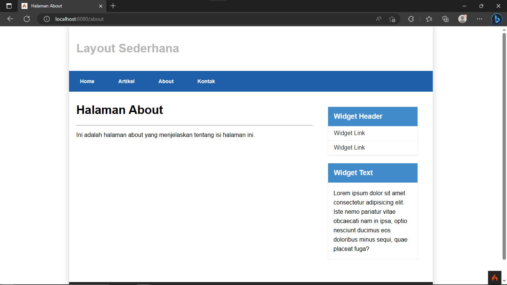
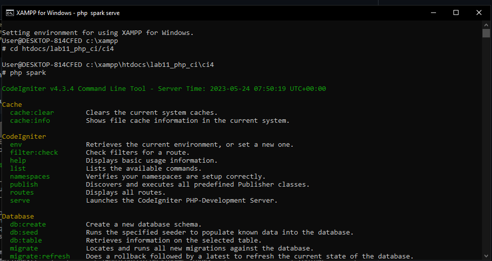
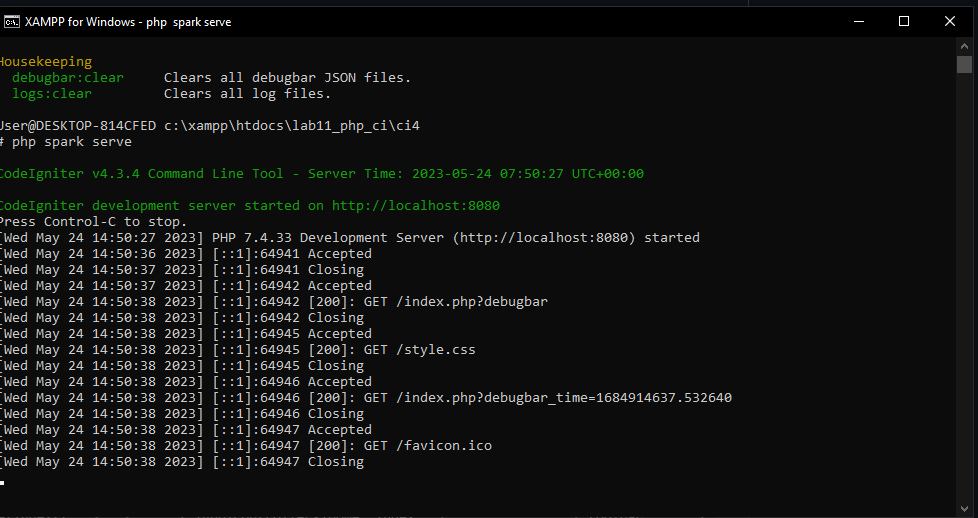

# lab11_php_ci
## hasil



Buka prompt shell di xampp, masuk ke direktori proyek kita dan jalankan server pengembangan dengan perintah berikut:
```php
php spark 
```


lalu ketikan :
```php
php spark serve
```


Buka Web browser dan buka alamat localhost:8080

## melengkapi Program


### Membuat Routes Baru
- Tambahkan kode berikut ke dalam Routes.php

```php
$routes->get('/about', 'Page::about');
$routes->get('/contact', 'Page::contact');
$routes->get('/faqs', 'Page::faqs');
```

### Membuat Controller Page
- Selanjutnya adalah membuat Controller Page. 
```php
<?php
namespace App\Controllers;
class Page extends BaseController
{
  public function about()
  {
    echo "Ini halaman About";
  }
  public function contact()
  {
    echo "Ini halaman Contact";
  }
  public function faqs()
  {
    echo "Ini halaman FAQ";
  }
}
```


### Auto Routing
 Secara default fitur autoroute pada Codeiginiter sudah aktif. Untuk mengubah status autoroute dapat
mengubah nilai variabelnya. Untuk menonaktifkan ubah nilai `true` menjadi `false`.

```php
$routes->setAutoRoute(true);
```

  Tambahkan method baru pada Controller Page seperti berikut.

```php
public function tos()
{
  echo "ini halaman Term of Services";
}
```


### Membuat View
Buat file baru dengan nama about.php pada direktori view (app/view/about.php) kemudian isi kodenya seperti berikut.

```php
<?= $this->include('template/header'); ?>
  <div class="content">
    <h1><?= $title; ?></h1>
    <hr>
    <p><?= $content; ?></p>
  </div>
<?= $this->include('template/footer'); ?>
```

 Ubah method about pada class Controller Page menjadi seperti berikut:

```php
public function about()
{
  return view('about', [
    'title' => 'Halaman About',
    'content' => 'Ini adalah halaman abaut yang menjelaskan tentang isi halaman ini.'
  ]);
}
```
## Buat web


  Buat file CSS pada direktori public dengan nama `style.css`.

  Kemudian buat folder `template` pada direktori view. lalu buat file baru dengan nama `header.php` dan `footer.php`.

- app/view/template/header.php

```php
<!DOCTYPE html>
<html lang="en">
<head>
  <meta charset="UTF-8">
  <title><?= $title; ?></title>
  <link rel="stylesheet" href="<?= base_url('/style.css'); ?>">
</head>
<body>
  <div id="container">
    <div class="header">
      <h1>Layout Sederhana</h1>
    </div>
    <nav>
      <a href="<?= base_url('/'); ?>">Home</a>
      <a href="<?= base_url('/artikel'); ?>">Artikel</a>
      <a href="<?= base_url('/about'); ?>">About</a>
      <a href="<?= base_url('/contact'); ?>">Kontak</a>
    </nav>
```

- app/view/template/footer.php

```php
<section id="wrapper">
  <section id="main">
  </section>
  <aside id="sidebar">
    <div class="widget-box">
      <h3 class="title">Widget Header</h3>
      <ul>
        <li><a href="#">Widget Link</a></li>
        <li><a href="#">Widget Link</a></li>
      </ul>
    </div>
    <div class="widget-box">
      <h3 class="title">Widget Text</h3>
      <p>
        Lorem ipsum dolor sit amet consectetur adipisicing elit. Iste nemo pariatur vitae obcaecati nam in ipsa, optio nesciunt ducimus eos doloribus minus sequi, quae placeat fuga?
      </p>
    </div>
  </aside>
</section>
<footer>
  <p>&copy; 2023 - Universitas Pelita Bangsa</p>
</footer>
</div>
</body>
</html>
```

- ubah file app/view/about.php seperti berikut.

```php
<?= $this->include('template/header'); ?>
  <div class="content">
    <h1><?= $title; ?></h1>
    <hr>
    <p><?= $content; ?></p>
  </div>
<?= $this->include('template/footer'); ?>
```

- `style.css`.

```css
body {
  font-family: Arial, sans-serif;
  margin: 0;
  padding: 0;
}

/* Container */
#container {
  width: 980px;
  margin: 0 auto;
  box-shadow: 0 0 1em #cccccc;
}

/* Header */
.header {
  padding: 20px;
  color: #b5b5b5;
}

/* Navigation */
nav {
  display: block;
  background-color: #1f5faa;
}

nav a {
  display: inline-block;
  padding: 20px 30px;
  color: #ffffff;
  font-size: 14px;
  font-weight: bold;
  text-decoration: none;
}

nav a.active,
nav a:hover {
  background-color: #2b83ea;
}

/* Wrapper */
#wrapper {
  display: flex;
  flex-wrap: wrap;
  justify-content: flex-end;
  margin: 20px;
}

/* Main Content */
#main {
  flex-basis: 65%;
  margin-right: 10px;
}

/* Sidebar */
#sidebar {
  float: left;
  width: 100%;
  padding: 20px;
}

/* Widget */
.widget-box {
  border: 1px solid #eee;
  margin-bottom: 20px;
}

.widget-box h3.title {
  margin: 0;
  padding: 15px 16px;
  background-color: #428bca;
  color: #fff;
}

.widget-box ul {
  margin: 0;
  padding-left: 0;
  list-style: none;
}

.widget-box li {
  border-bottom: 1px solid #eee;
}

.widget-box li a {
  display: block;
  padding: 10px 16px;
  color: #333;
  text-decoration: none;
}

.widget-box li:hover a {
  background-color: #eee;
}

.widget-box p {
  padding: 0 15px;
  line-height: 25px;
}

/* Footer */
footer {
  background-color: rgb(40, 40, 40);
  color: #fff;
  padding: 5px;
  text-align: center;
}

/* Content */
.content {
  padding: 10px 20px;
  float: left;
  width: 65%;
  flex-basis: 100%;
}
```

- Selanjutnya refresh halaman web pada alamat: http://localhost:8080/about


